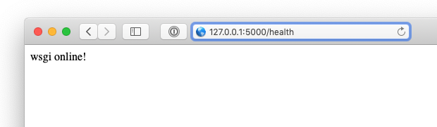

Step 3: Creating a Flask API
==============================

You're we're now ready to create our Flask API, and we're going to use **flaskerize** to do most of this for us.

**flaskerize** has a number of :term:`generators` that generate code and configuration for us.
These :term:`generators` use :term:`schematics` to define exactly what code should be built.
There are a number of :term:`schematics` build into  **flaskerize**.

We're going to start by using the ``flask-api`` generator to create a simple Flask API.

From the root of your project folder, run the following command:

.. code-block:: bash

  fz generate flask-api my_app

You'll see output similar to the following:

.. code-block:: bash

  $ fz generate flask-api my_app
  Flaskerizing...

  Flaskerize job summary:

          Schematic generation successful!
          Full schematic path: flaskerize/schematics/flask-api

          13 directories created
          40 file(s) created
          0 file(s) deleted
          0 file(s) modified
          0 file(s) unchanged

  CREATED: flaskerize-example/.pytest_cache
  CREATED: flaskerize-example/.pytest_cache/v
  CREATED: flaskerize-example/.pytest_cache/v/cache
  CREATED: flaskerize-example/my_app
  CREATED: flaskerize-example/my_app/__pycache__
  CREATED: flaskerize-example/my_app/app
  CREATED: flaskerize-example/my_app/app/__pycache__
  CREATED: flaskerize-example/my_app/app/test
  CREATED: flaskerize-example/my_app/app/test/__pycache__
  CREATED: flaskerize-example/my_app/app/widget
  CREATED: flaskerize-example/my_app/app/widget/__pycache__
  CREATED: flaskerize-example/my_app/commands
  CREATED: flaskerize-example/my_app/commands/__pycache__
  CREATED: .gitignore
  CREATED: .pytest_cache/.gitignore
  CREATED: .pytest_cache/CACHEDIR.TAG
  CREATED: .pytest_cache/README.md
  CREATED: .pytest_cache/v/cache/lastfailed
  CREATED: .pytest_cache/v/cache/nodeids
  CREATED: .pytest_cache/v/cache/stepwise
  CREATED: my_app/README.md
  CREATED: my_app/__pycache__/manage.cpython-37.pyc
  CREATED: my_app/__pycache__/wsgi.cpython-37.pyc
  CREATED: my_app/app/__init__.py
  CREATED: my_app/app/__pycache__/__init__.cpython-37.pyc
  CREATED: my_app/app/__pycache__/config.cpython-37.pyc
  CREATED: my_app/app/__pycache__/routes.cpython-37.pyc
  CREATED: my_app/app/app-test.db
  CREATED: my_app/app/config.py
  CREATED: my_app/app/routes.py
  CREATED: my_app/app/test/__init__.py
  CREATED: my_app/app/test/__pycache__/__init__.cpython-37.pyc
  CREATED: my_app/app/test/__pycache__/fixtures.cpython-37.pyc
  CREATED: my_app/app/test/fixtures.py
  CREATED: my_app/app/widget/__init__.py
  CREATED: my_app/app/widget/__pycache__/__init__.cpython-37.pyc
  CREATED: my_app/app/widget/__pycache__/controller.cpython-37.pyc
  CREATED: my_app/app/widget/__pycache__/interface.cpython-37.pyc
  CREATED: my_app/app/widget/__pycache__/model.cpython-37.pyc
  CREATED: my_app/app/widget/__pycache__/schema.cpython-37.pyc
  CREATED: my_app/app/widget/__pycache__/service.cpython-37.pyc
  CREATED: my_app/app/widget/controller.py
  CREATED: my_app/app/widget/interface.py
  CREATED: my_app/app/widget/model.py
  CREATED: my_app/app/widget/schema.py
  CREATED: my_app/app/widget/service.py
  CREATED: my_app/commands/__init__.py
  CREATED: my_app/commands/__pycache__/__init__.cpython-37.pyc
  CREATED: my_app/commands/__pycache__/seed_command.cpython-37.pyc
  CREATED: my_app/commands/seed_command.py
  CREATED: my_app/manage.py
  CREATED: my_app/requirements.txt
  CREATED: my_app/wsgi.py

Navigate into the `my_app` directory that was just created and list the files in that directory:

.. code-block:: bash

  $ cd my_app
  $ ls -al
  total 32
  drwxr-xr-x  9 bob  staff   288  4 Oct 15:01 .
  drwxr-xr-x  6 bob  staff   192  4 Oct 15:01 ..
  -rw-r--r--  1 bob  staff  1063  4 Oct 15:01 README.md
  drwxr-xr-x  4 bob  staff   128  4 Oct 15:01 __pycache__
  drwxr-xr-x  9 bob  staff   288  4 Oct 15:01 app
  drwxr-xr-x  5 bob  staff   160  4 Oct 15:01 commands
  -rw-r--r--  1 bob  staff   673  4 Oct 15:01 manage.py
  -rw-r--r--  1 bob  staff   409  4 Oct 15:01 requirements.txt
  -rw-r--r--  1 bob  staff   141  4 Oct 15:01 wsgi.py

As you can see, a number of files and folders have been created.
One of the files that was just created is a ``README.md`` markdown file.
If you open that file in a text editor find instructions on settng up your API.
Those instructions are repeated here for convinience, but I'd recommend you take a look at ``README.md`` file regardless.

Following the Instructions from README.md
^^^^^^^^^^^^^^^^^^^^^^^^^^^^^^^^^^^^^^^^^

First, use ``pip install`` to install the requirements of your new API

.. code-block:: bash

  pip install -r requirements.txt

Next, initialize the database

.. code-block:: bash

  python manage.py seed_db

This step create a local SQLite database file.

.. note:: Type "Y" to accept the message. This check is there to prevent you accidentally deleting things.

Confirm your API is working
^^^^^^^^^^^^^^^^^^^^^^^^^^^

You're now ready to confirm that your API is working.

You can use the Flask command line interface to confirm that your Flask API is working by first using the ``flask routes`` command.
This will print out all of the routes supported by your Flask API:

.. code-block:: bash

  $ flask routes
  Endpoint                   Methods           Rule
  -------------------------  ----------------  --------------------------
  Widget_widget_id_resource  DELETE, GET, PUT  /api/widget/<int:widgetId>
  Widget_widget_resource     GET, POST         /api/widget/
  doc                        GET               /
  health                     GET               /health
  restx_doc.static        GET               /swaggerui/<path:filename>
  root                       GET               /
  specs                      GET               /swagger.json
  static                     GET               /static/<path:filename>

As you can see, a number of routes have been generated.

Now, you can run your Flask API using ``flask run`` or by running ``python wsgi.py``:

.. code-block:: bash

  $ python wsgi.py
  * Serving Flask app "app" (lazy loading)
  * Environment: production
    WARNING: This is a development server. Do not use it in a production deployment.
    Use a production WSGI server instead.
  * Debug mode: on
  * Running on http://127.0.0.1:5000/ (Press CTRL+C to quit)
  * Restarting with stat
  * Debugger is active!
  * Debugger PIN: 304-898-518

While the Flask app is running, open http://127.0.0.1:5000/health within your favourite browser,
and you should be greated with the Swagger documentation for your API.

You can use this UI to try getting all of the Widgets from your API.
Alternatively, you can use the command line to call your api using ``curl``.
Execute the following command:

``curl -X GET "http://127.0.0.1:5000/api/widget/" -H "accept: application/json"``

This should return a JSON response, containing the entity details for the 3 Widgets currently stored in your SQL Lite database.

.. code-block:: bash

  $ curl -X GET "http://127.0.0.1:5000/api/widget/" -H "accept: application/json"
  [
      {
          "name": "Pizza Slicer",
          "widgetId": 1.0,
          "purpose": "Cut delicious pizza"
      },
      {
          "name": "Rolling Pin",
          "widgetId": 2.0,
          "purpose": "Roll delicious pizza"
      },
      {
          "name": "Pizza Oven",
          "widgetId": 3.0,
          "purpose": "Bake delicious pizza"
      }
  ]

What Now?
^^^^^^^^^

**flaskerize** has very quickly set up a Flask API for you, including...

- the core API, and all the plumbing to set up routes
- an entity called "Widget"
- code to set up and seed a local database
- tests

In the next section we'll dig deeper into what happened when you ran ``fz generate flask-api my_app``, the structure of your Flask API, and what each of the generated files do.
