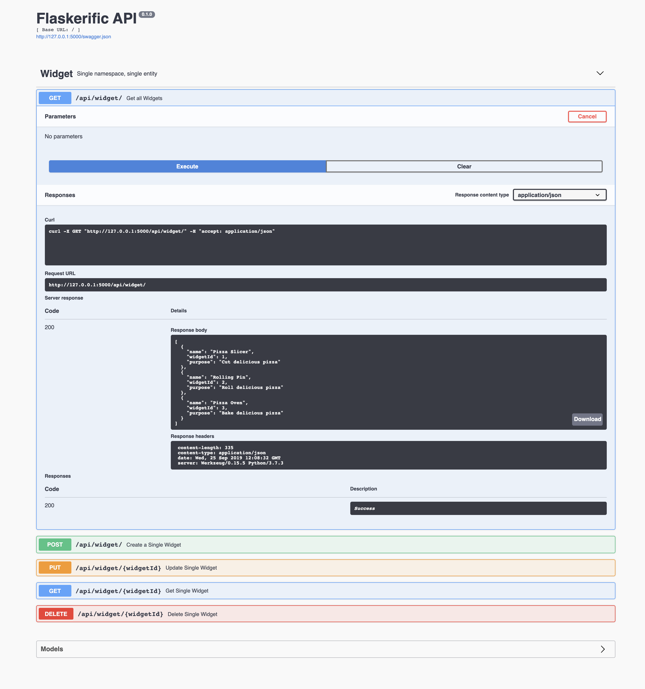

# Schematics built into flaskerize

The following is a summary/description of the various schematics that ship with `flaskerize` itself

### Entity

An `entity` is a combination of a Marshmallow schema, type-annotated interface, SQLAlchemy model, Flask controller, and CRUD service as described [in this blog post](http://alanpryorjr.com/2019-05-20-flask-api-example/). It contains tests and provides functionality for being registered within an existing Flask application via its `register_routes` method in `__init__.py`.

_Additional parameters:_

- None (only uses the default/required `name` parameter)

_Example Usage_

The command `fz generate entity path/to/my/doodad` would produce an `entity` with the following directory structure.

_Note: the current version of `flaskerize` generates the code for an Entity, but does not yet automatically wire it up to an existing application, configure routing, etc. That will come soon, but for now you will need to make that modification yourself. To do so, invoke the `register_routes` method from the entity's \_\_init\_\_py file from within your application factory. For more information, check out [a full working example project here](https://github.com/apryor6/flask_api_example)._

```
path
└── to
    └── my
        └── doodad
            ├── __init__.py
            ├── controller.py
            ├── controller_test.py
            ├── interface.py
            ├── interface_test.py
            ├── model.py
            ├── model_test.py
            ├── schema.py
            ├── schema_test.py
            ├── service.py
            └── service_test.py
```

### Schematic

Flaskerize would be remiss if there was not a schematic for generating new, blank schematics.

_Additional parameters:_

- None (only uses the default/required `name` parameter)

_Example Usage_

The command `fz generate schematic path/to/schematics/new_schematic` would produce a new schematic with the following directory structure.


```
path
└── to
    └── schematics
        └── new_schematic
            ├── custom_functions.py
            ├── files
            ├── new_schematic
            ├── run.py
            └── schema.json
```


### flask-api

A basic Flask app with SQLAlchemy that follows the pattern [here](http://alanpryorjr.com/2019-05-20-flask-api-example/). This is intended to be used alongside the entity schematic for speedy development

_Example usage_

```
fz generate flask-api my_app
```

Creates:

```
├── README.md
├── app
│   ├── __init__.py
│   ├── __init__test.py
│   ├── app-test.db
│   ├── config.py
│   ├── routes.py
│   ├── test
│   │   ├── __init__.py
│   │   └── fixtures.py
│   └── widget
│       ├── __init__.py
│       ├── controller.py
│       ├── controller_test.py
│       ├── interface.py
│       ├── interface_test.py
│       ├── model.py
│       ├── model_test.py
│       ├── schema.py
│       ├── schema_test.py
│       ├── service.py
│       └── service_test.py
├── commands
│   ├── __init__.py
│   └── seed_command.py
├── manage.py
├── requirements.txt
└── wsgi.py
```

The app can then be run with the following steps (also documented in the README that is generated)

```
cd my_app
virtualenv -p python3 venv
source venv/bin/activate
pip install -r requirements.txt
python manage.py seed_db
python wsgi.py
```

Navigating to http://localhost:5000 then should yield the swagger docs:




### flask-plotly

A basic Flask app that renders a plotly chart via a blueprint

_Example usage_

```
fz generate flask-plotly my_app/
cd my_app
virtualenv -p python3 venv
source venv/bin/activate
pip install -r requirements.txt
python wsgi.py
```

Creates:

```
my_app
├── app
│   ├── __init__.py
│   ├── config.py
│   ├── main
│   │   ├── __init__.py
│   │   └── view.py
│   └── templates
│       ├── base.html
│       └── plotly-chart.html
├── requirements.txt
└── wsgi.py
```

### setup

`setup` creates a `setup.py` file.

_Additional parameters:_

```
    {
      "arg": "--version",
      "type": "str",
      "default": "0.1.0",
      "help": "Current project version"
    },
    {
      "arg": "--description",
      "type": "str",
      "default": "Project built by Flaskerize",
      "help": "Project description"
    },
    {
      "arg": "--author",
      "type": "str",
      "help": "Project author"
    },
    {
      "arg": "--author-email",
      "type": "str",
      "help": "Project author"
    },
    {
      "arg": "--url",
      "type": "str",
      "default": "https://github.com/apryor6/flaskerize",
      "help": "Project website / URL"
    },
    {
      "arg": "--install-requires",
      "type": "str",
      "nargs": "+",
      "help": "Requirements"
    }
```

_Example Usage_

`fz generate setup demo/doodad`

Creates the following directory structure:

```
demo
└── setup.py
```

Where the contents of setup.py correspond to a new package named "doodad"
